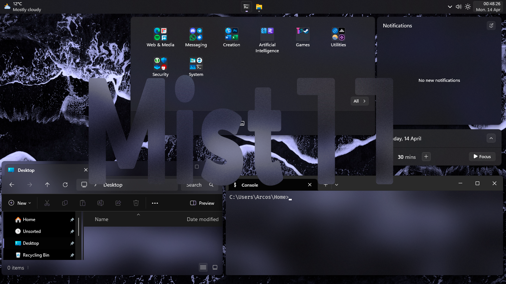

TODO
 - [ ] Make Wiki
 - [ ] Make configuration setup per resolution

# Mist11
*A compilation of WindHawk mod configurations and tweaks to make Microsoft's operating system truly beautiful.*

> [!NOTE]
> You will need to tweak the values in the configurations themselves to adapt to your system; their values are on the Wiki. This mod was made in a single 1366x768 display, Windows 11 24H2.

Install all the mods and import their configurations before you start tweaking.
There a small inconsistencies regarding animations of certain elements, but they don't impact functionality.
If you manage to fix these inconsistencies and/or find a series of configurations that work for a layout in a screen resolution not defined below, please share them with a commit.
Acrylic zones will appear fully transparent on peek. It can be disabled in advanced system configuration.

## Setup
Install [WindHawk](https://windhawk.net/) along with the following mods. Make sure to allow modifications of `dwm.exe`, `SearchHost.exe` and `ExplorerFrame.exe` in WindHawk settings.
*"Strict dependency" means if the mod is required for a cohesive experience or not. All are still recommended.*
| Mod ID | Version | Strict Dependency |
|--|--|--|
| windows-11-taskbar-styler | 1.3.10 | YES |
| windows-11-start-menu-styler | 1.2.1 | YES |
| windows-11-notification-center-styler | 1.1.6 | YES |
| translucent-windows | 1.4.1 | YES |
| taskbar-clock-customization | 1.5.2 | YES |
| taskbar-icon-size | 1.2.17 | YES |
| taskbar-tray-system-icon-tweaks | 1.2.2 | YES |
| taskbar-notification-icon-spacing | 1.1.2 | NO |
| taskbar-on-top | 1.1.2 | NO |
| notifications-placement | 1.1 | NO |
| explorerframe-fixes-for-win11-22h2plus | 1.0.1 | NO |
| file-explorer-remove-suffixes | 1.0 | NO |
| slick-window-arrangement | 1.0.2 | NO |

You will also have to enable the file explorer and settings icons in the start menu from system settings, along with transparency effects. I advise centering the icons in the taskbar and enabling the weather widget. The feed and distractions can be disabled by setting it up properly.

To get the full intended experience, it's advised that apart from the WindHawk mods, you use the following to provide an elevated look and feel experience:
 - A dark wallpaper that's mainly black with cold-colored, desaturated details. (Like the one provided in this repo)
 - An accent color directly picked from said wallpaper. (Like #A0A0FF)
 - Cursor from [Shalompanna](https://www.deviantart.com/shalompanna) or [JepriCreations](https://www.deviantart.com/jepricreations).
 - [Rectify11](https://rectify11.net/home), Solid black theme. 
 - TranslucentTB. Configuration file has it's same name.

> [!WARNING]
> Rectify11 can only be installed in fresh OS deployments. Mica options must be DESELECTED upon installation.
> Don't use these mods with MicaForEveryone either.
> I advise AGAINST using StartAllBack, OpenShell, ExplorerPatcher, Start11 and similar software when using these mods.

## Configuration Parameters
WIP - Coming in the following days.

## Acknowledgement
 - Ageo typeface by [Eko Bimantada](https://fontesk.com/designer/eko-bimantara/).
 - Aerial view of waves by [Idan Canfi](https://www.pexels.com/@idan-canfi-779084/).
 - Windhawk by [Ramen Software](https://ramensoftware.com/) ([Michael Maltsev](https://github.com/m417z)).
 - Mods these configurations are based on by [Undisputed00x](https://github.com/Undisputed00x).
 - TranslucentTB by [Charles Milette](https://github.com/sylveon), [Emma Smith](https://github.com/emmatyping) and [Oliver Cheng](https://github.com/olliecheng).
